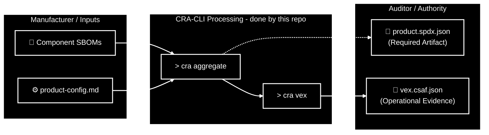

# CRA-CLI — EU Cyber Resilience Act Compliance Tooling

A Python CLI tool that helps organizations comply with the **EU Cyber Resilience Act (CRA)** by automating the creation of **Product-level SBOMs** and **VEX (Vulnerability Exploitability eXchange)** documents.

## Why Compliance Matters

For **Auditors** and **Market Surveillance Authorities**, this tool produces the legally required artifacts:

- **SBOM** (`product.spdx.json`) — The **Required Artifact**. A complete inventory of your software components.
- **VEX** (`vex.csaf.json`) — The **Required Operational Evidence**. Proof that you have assessed vulnerabilities and determined their impact.

**Crucial Compliance Requirements:**
1. **Continuous Updates**: Both documents must be kept up-to-date with every release or vulnerability disclosure.
2. **Authority Requests**: Both must be provided to authorities upon request to prove conformity.
3. **Process Linkage**: These artifacts serve as evidence that your **secure update processes** and **vulnerability reporting timelines** are functioning (e.g., addressing critical risks promptly).

## Features

- **`cra aggregate`** — Merge multiple component SBOMs (SPDX JSON from Syft) into a single Product SBOM with automatic namespace isolation and deduplication.
- **`cra vex`** — Generate a CSAF 2.0 VEX document by scanning the Product SBOM with Trivy (or any scanner) and applying manual triage rules from a Markdown file.

## Workflow Overview



### File Classification

#### � **Component SBOMs** (Input)
- `frontend.spdx.json`, `firmware.spdx.json`, etc.
- Generated by tools like [Syft](https://github.com/anchore/syft).
- One per component in your product.

#### ⚙️ **Configuration** (Input)
- `product-config.md`
- Defines which SBOMs to merge and your vulnerability triage rules.
- See [examples/product-config.md](examples/product-config.md).

#### � **Product SBOM** (Final Artifact & VEX Input)
- **`product.spdx.json`**
- **Role**: REQUIRED ARTIFACT for auditors.
- **Function**: complete inventory of your entire product.
- *Note: This file is also used as the input for the VEX generation step.*

#### 📃 **VEX Document** (Final Artifact)
- **`vex.csaf.json`**
- **Role**: OPERATIONAL EVIDENCE for auditors.
- **Function**: Proof of vulnerability assessment and triage.
- Complies with EU Cyber Resilience Act requirements.

### Process Flow

1. **Aggregate** (`> cra aggregate`) → Merges **Component SBOMs** into one **Product SBOM**.
2. **Scan & Triage** (`> cra vex`) → Scans the Product SBOM and applies triage rules to generate the **VEX Document**.
3. **Deliver** → Provide both the **Product SBOM** and **VEX Document** to auditors.

## Installation

```bash
# Create and activate a virtual environment
python3 -m venv .venv
source .venv/bin/activate

# Install the package
pip install -e ".[dev]"
```

**External tools** (optional, for vulnerability scanning):
- [Trivy](https://aquasecurity.github.io/trivy/) — `brew install trivy`

## Quick Start

### 1. Create a `product-config.md`

This Markdown file defines which component SBOMs belong to your product and how to triage known vulnerabilities:

```markdown
## SBOM Manifest

| Component Name | Path                      | Description                |
|----------------|---------------------------|----------------------------|
| Frontend       | sboms/frontend.spdx.json  | React admin dashboard      |
| Backend        | sboms/backend.spdx.json   | Python API service         |

## VEX Triage

| CVE ID         | Status             | Justification                       | Impact                          |
|----------------|---------------------|-------------------------------------|---------------------------------|
| CVE-2021-44228 | known_not_affected  | vulnerable_code_not_in_execute_path | Log4j JNDI is disabled          |
| CVE-2023-44487 | known_affected      |                                     | HTTP/2 rapid reset — upgrading  |
```

### 2. Aggregate SBOMs

```bash
cra aggregate --config product-config.md --name "MyProduct" --version "2.0"
```

Output: `product.spdx.json`

### 3. Generate VEX

```bash
# Using Trivy (auto-invoked):
cra vex --config product-config.md --vendor "MyCompany"

# Using pre-generated scanner results:
cra vex --config product-config.md --scan-results trivy-results.json
```

Output: `vex.csaf.json`

## Architecture

```
cra-cli/
├── pyproject.toml        # Package config & dependencies
├── src/
│   ├── main.py           # CLI entry point (Typer app)
│   ├── config.py         # Markdown parsing (markdown-it-py)
│   ├── merger.py         # SPDX merge logic (hybrid JSON + lib4sbom)
│   └── vex.py            # CSAF 2.0 VEX generation (csaf-tool)
└── tests/
    ├── conftest.py       # Shared fixtures
    ├── test_config.py    # Config parser tests
    ├── test_merge.py     # SBOM merger tests
    └── test_vex.py       # VEX generation tests
```

### Key Design Decisions

| Decision | Rationale |
|----------|-----------|
| **Hybrid JSON approach** for SBOM merging | Raw JSON for SPDXID prefixing (precise control), `spdx-tools` for validation |
| **csaf-tool** for VEX generation | Industry-standard CSAF 2.0 output, by Anthony Harrison |
| **markdown-it-py** for config parsing | Robust AST-based table extraction, no regex |
| **Namespace isolation** | Prevents SPDXID collisions when merging SBOMs that share default IDs like `SPDXRef-Package-...` |
| **Modular scanner** | Trivy is the default, but users can pass any scanner's JSON output via `--scan-results` |

### VEX Triage Statuses (CSAF)

| Status | Meaning | Requires |
|--------|---------|----------|
| `under_investigation` | Assessment in progress | *(default for untriaged CVEs)* |
| `known_not_affected` | Confirmed not affected | Justification |
| `known_affected` | Confirmed affected | — |
| `fixed` | Vulnerability remediated | — |

### Valid Justifications (for `known_not_affected`)

- `component_not_present`
- `vulnerable_code_not_in_execute_path`
- `vulnerable_code_cannot_be_controlled_by_adversary`
- `inline_mitigations_already_exist`

## Running Tests

```bash
python -m pytest tests/ -v
```

## Dependencies

| Package | Purpose |
|---------|---------|
| `typer` | CLI framework |
| `lib4sbom` | SPDX parsing/generation |
| `lib4vex` | VEX document utilities |
| `csaf-tool` | CSAF 2.0 document generation |
| `spdx-tools` | SPDX validation |
| `markdown-it-py` | Markdown table parsing |
| `packageurl-python` | Package URL handling |

## Contributing

Contributions are welcome. Please refer to [CONTRIBUTING.md](CONTRIBUTING.md) for guidelines.

## License

Licensed under the [Apache License, Version 2.0](LICENSE).
